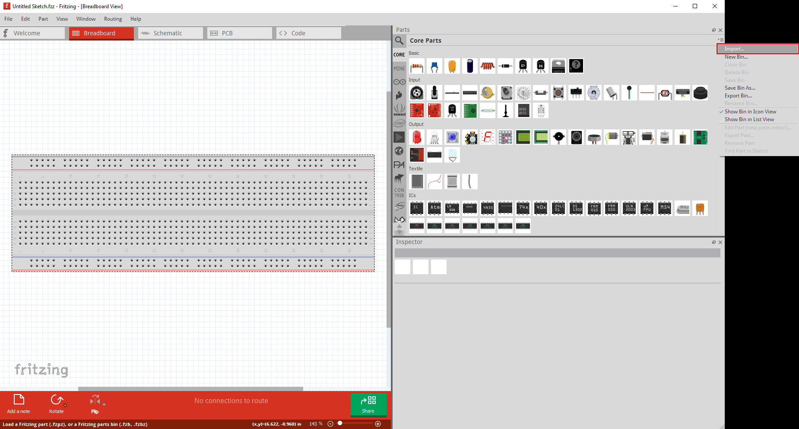
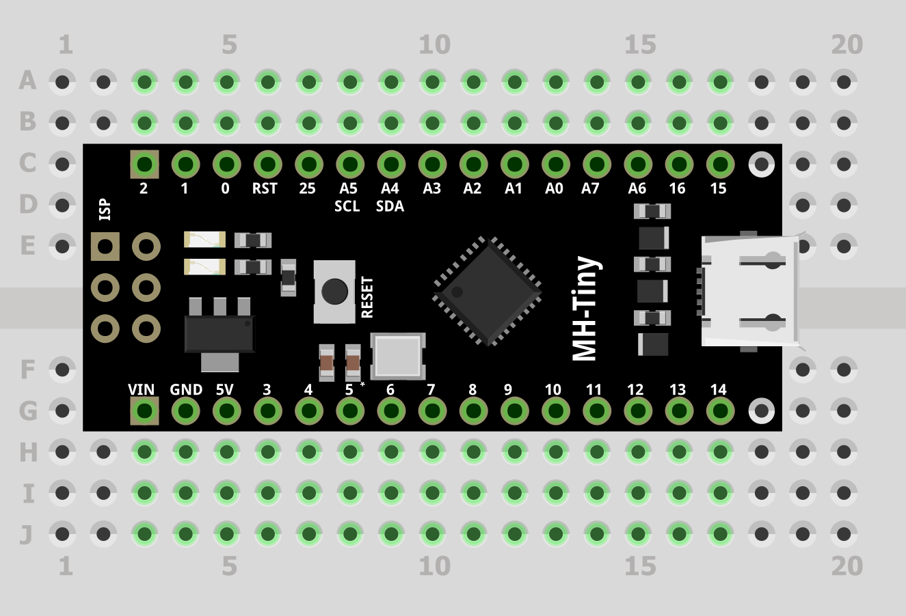

# My Fritzing parts
Here are my selfmade parts for using in [Fritzing](https://github.com/fritzing/fritzing-app). Just pull the whole repository or download only the *.fzpz file you need. 

## Import
In Fritzing, on the right side, click on the small hamburger button dropdown menu and select "Import...". Then you can search for the file/s you downloaded.

## Parts
#### [MH-Tiny ATTiny88 Board](./parts/MH-Tiny_ATTiny88_Board.fzpz)
